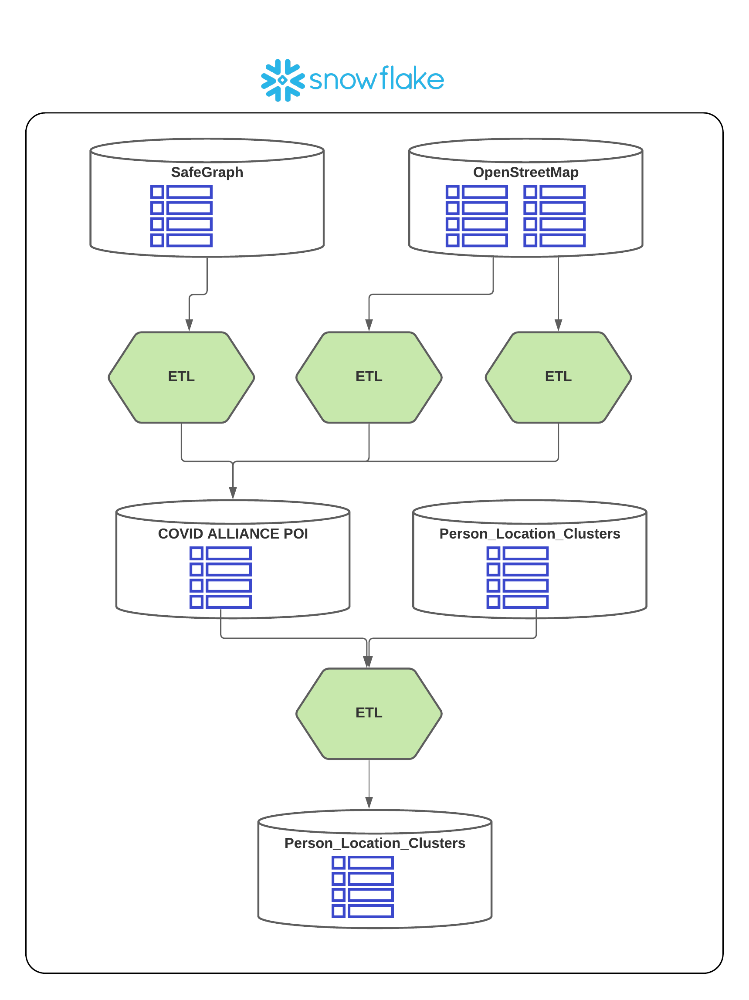

# covid_alliance

## Intro
The COVID Alliance (https://www.covidalliance.org) is a volunteer-powered nonprofit coalition bringing together best-in-class expertise across science, technology, and policy in a coordinated response to COVID-19. The team consists of epidemiologists, virologists, policy experts, medical informaticians, data scientists, and software engineers.

As a Data Engineering Fellow in the Insight Fellows program (https://insightfellows.com/) I was offered the opportunity to do consulting work for the Covid 
Alliance for my fellowship project. Like many other New Yorkers, I was horrified by the impact Covid had in the city, as well of course as throughout the country and world; so I was grateful for the the opportunity to try to do something useful with data for Covid research.

## Project Focus
This project focuses on unifying disparate places-of-interest ("POI") datasets that the Alliance has, while also trying to enable efficient joins of that POI data
with the person-location "cluster" data the Alliance has. The Alliance has large (anonymous) cell ping location data which is mined to yield "clusters" representing individual "person-locations" - in other words, given rows of data that represent the locations (via latitude/longitude coordinates) of specific persons (again, to be crystal clear, utterly anonymous and even device-blind data) at specific times. Location, or "POI" data, can be provisioned with sufficient geo-spatial features to allow matching with person-location data.  This kind of "matching" of POI data can enable, for example, modeling of social distancing metrics, or predictions what locations may becoome populous at what times.

## Datasets
### OpenStreetMaps
The Covid Alliance has OpenStreetMap (OSM) data, as well as location data from Safegraph.  OSM data is very rich, with a fairly complex data model. There are many tables containing sub-categories of POI data, but the OSM Amenity table contains all (United States-specific) places, with the exception of "shops", which are contained in a separate table. These tables diverge in terms of their attributes, but both tables denote the location with a "coordinates" field, which is a GeoJSON datatype describing a polygon that represents the coordinates of the actual place. Another way to think of the coordinates of OSM POI data is as a "bounding box", defining the overall area that the place itself takes up.

### SafeGraph
SafeGraph POI data defines similar, but different, sets of fields for POIs. A notable difference from OSM POI data is the fact that SafeGraph denotes the POI by latitude/longitude points only. So a large shopping mall, for example, that might spread over multiple acres of land, is nevertheless denoted by a single geographic lat/long coordinate, and not by the bounding box that defines its area.

## Harmonization
Not surprisingly, harmonization of geo-spatial features was a key part of my focus. I preserved the lat/long coordinates of SafeGraph data, but also preserved the boundingbox coordinates of OSM data. How? The SafeGraph lat/long coordiantes were converted to GeoJSON coordinates (Snowflake calls this a "Geography" data type), notwithstanding that the bounding box would contain the single lat/long point. And, while preserving OSM coordinates, I also derived a single lat/long point for the OSM POI by getting the centroid of the bounding box.

I also went through an extensive process of harmonizing other POI fields from each of the datasets, looking for the most general and universal attributes, and converging on a single nomenclature.

## Table Performance
The POI table is necessarily very wide, given the goal of unifying and harmonizing disparate datasets, while also providing as much detail as possible, especially around geo-spatial features.  However, an equally important goal is to ensure that the table performs well for queries, given the overriding goal of enriching person-location data with POI data (or conversely, enriching POI data with person-location data).

Snowflake geospatial functions are quite powerful, but tend to be expsensive to run, often requiring multiple column values for function input parameters, and operating on each and every row of each table specified in a join.

A trick to optimization is to use a geohash, which is an encoded string representing geographic coordinates. Geohashes have the property that characters can be removed from the righthand side of the string, resulting in a broader geographic area (so-called "tile size"), while preserving geographic accuracy.

I precomputed geohashes for all POI data, but also precomputed a shortened form of the geohash, taking advantage of the fact that this short geohash (length 8) would be suitable for "geo-matching".

## ETL Flow
The diagram below shows the flow of the ETL jobs in Snowflake:

